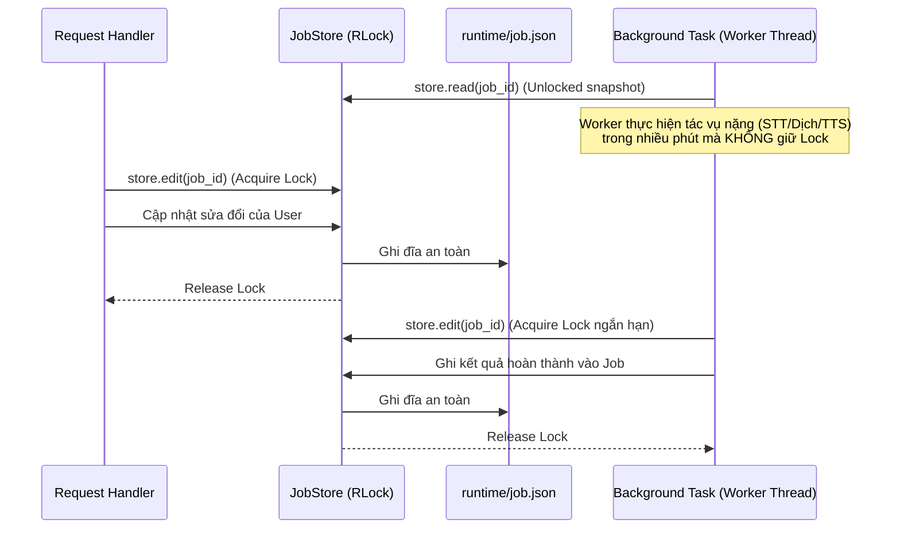
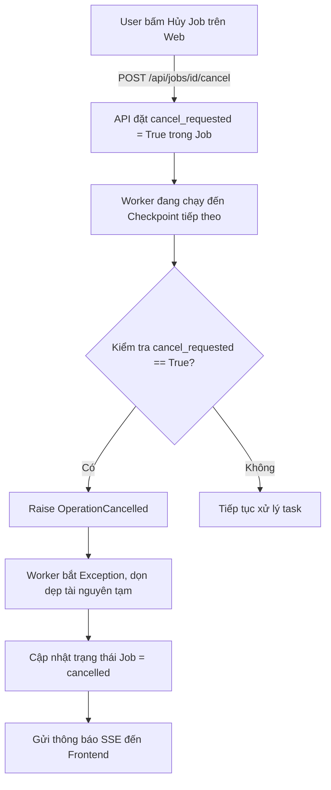
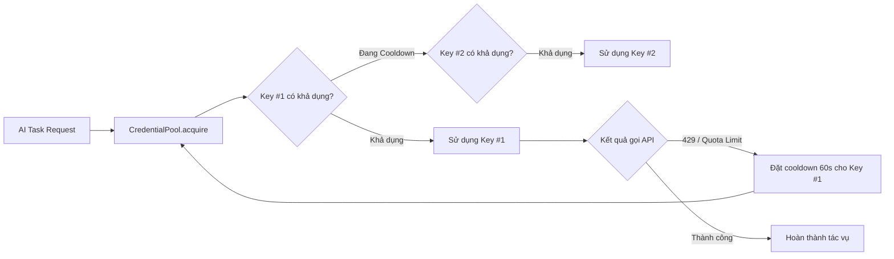

# Cấu Trúc & Kiến Trúc Chi Tiết Backend Hiện Tại (AutoCC)

Tài liệu này phân tích chi tiết toàn bộ cấu trúc thư mục, mục đích và trách nhiệm của từng tệp tin trong mã nguồn **Backend hiện tại** của dự án AutoCC.

---

## 1. Tổng Quan Kiến Trúc Hiện Tại

Backend của AutoCC được xây dựng trên nền tảng **FastAPI (Python 3.10+)** với thiết kế hướng module, tối ưu cho các tác vụ xử lý đa phương tiện (Video/Audio) và AI pipelines chạy nền kéo dài (long-running jobs).

### Các nguyên lý thiết kế chính trong Backend hiện tại:
1. **FastAPI Facade & Modularity**: Tách biệt route definitions (facade) và business/lifecycle operations.
2. **Dedicated Background Worker Pool**: Không sử dụng `BackgroundTasks` mặc định của FastAPI mà xây dựng `JobRunner` riêng với `ThreadPoolExecutor` có kiểm soát concurrency và bắt exception/lỗi toàn diện.
3. **Thread-Safe File Persistence (`JobStore`)**: Trạng thái job lưu dưới dạng JSON trong `runtime/<job_id>/job.json`, quản lý cập nhật bằng `threading.RLock` ngắn hạn (short-lived critical sections), tránh race condition giữa user edits và background workers.
4. **Cooperative Cancellation**: Cơ chế hủy job qua cờ `cancel_requested` và thread-local hooks (`cancellation.py`), cho phép dừng an toàn tại các checkpoint mà không làm hỏng dữ liệu.
5. **API Key Pool Rotation**: Xoay vòng nhiều API key tự động với cơ chế cooldown/strikes khi gặp rate limits (`apikeys.py`).
6. **Script-Aware Subtitle Processing**: Hỗ trợ thuật toán xử lý ngắt dòng, căn chỉnh phụ đề chuyên sâu cho cả chữ Latin và ký tự CJK (Trung - Nhật - Hàn).
7. **Realtime SSE Streaming**: Truyền phát tiến độ (progress) và sự kiện thời gian thực đến Client mà không ghi đĩa thừa thãi.

---

## 2. Sơ Đồ Cây Thư Mục Toàn Diện

```text
backend/
├── __init__.py                     # Package marker cho backend module
├── app.py                          # Khởi tạo FastAPI app, middlewares, CORS, exception handlers, static frontend
│
├── core/                           # Hạ tầng kỹ thuật nền tảng dùng chung (không phụ thuộc domain/AI)
│   ├── __init__.py
│   ├── apikeys.py                  # Quản lý credential pool, xoay vòng & cooldown API keys
│   ├── cancellation.py             # Cơ chế cooperative cancellation (ngắt tác vụ an toàn)
│   ├── config.py                   # Cấu hình hệ thống, nạp .env, paths (ROOT/FRONTEND/RUNTIME), loggers
│   ├── httpclient.py               # HTTP client dùng chung (retry exponential backoff, timeout, connection pooling)
│   └── messages.py                 # Hệ thống mã hóa thông báo đa ngôn ngữ i18n (Message, CodedError, error keys)
│
├── domain/                         # Nghiệp vụ & thuật toán cốt lõi (Pure Python, không gọi ffmpeg/AI trực tiếp)
│   ├── __init__.py
│   ├── subtitles/
│   │   ├── __init__.py
│   │   ├── parser.py               # Parser & Serializer SRT/VTT, CJK-aware splitting, cue cleaning, timecode
│   │   ├── layout.py               # Layout, dialogue normalization, ngắt dòng tự động
│   │   └── styles.py               # Quản lý style phụ đề ASS, font rendering, style presets CRUD
│   ├── dubbing/
│   │   ├── __init__.py
│   │   ├── aligner.py              # `fit_segment`, `dub_cues`, caching, assembly — thuật toán khớp thời lượng dubbing
│   │   └── audio_dsp.py            # Xử lý PCM thuần Python: trim_silence, pcm_seconds, write_wav (không gọi ffmpeg)
│   └── translation/
│       ├── __init__.py
│       └── style.py                # Quản lý style dịch thuật (tones, custom prompts, từ điển thuật ngữ)
│
├── infrastructure/                 # Giao tiếp thiết bị & dịch vụ bên ngoài
│   ├── __init__.py
│   ├── media/
│   │   ├── __init__.py
│   │   └── ffmpeg.py               # Wrapper FFmpeg/FFprobe: extract audio, decode/retime PCM, mux, burn sub, probe
│   └── providers/                  # Registry adapter cho từng nhà cung cấp (Protocol + implementation lookup)
│       ├── __init__.py             # Package init, re-export get_*_provider
│       ├── transcription.py        # STT: faster_whisper (local), deepgram (cloud)
│       ├── translation.py          # Dịch: mock, transformers (local HF pipeline), openai_compatible (Ollama/LM Studio/hosted)
│       └── tts.py                  # TTS: edge (EdgeTTS), mock
│
├── ai/                             # Tầng AI Engine & Pipelines chuyên sâu
│   ├── __init__.py                 # Xuất các hàm cấp cao: transcribe_video, translate_cues, analyze_dialogue_turns
│   ├── diarization.py              # Phân tích người nói (Speaker Turn Analysis / Diarization) bằng LLM
│   ├── llm.py                      # Client OpenAI-compatible chat-completions (Ollama, LM Studio, hoặc endpoint hosted bất kỳ) + pipeline transformers local
│   ├── shared.py                   # Lỗi, logger, op tags và progress callback dùng chung cho AI
│   ├── transcription.py            # Pipeline STT (Faster-Whisper local, Deepgram cloud)
│   ├── translation.py              # Pipeline dịch thuật phụ đề (batching cues, prompt injection, retry parse)
│   └── tts.py                      # Orchestrator Text-to-Speech (EdgeTTS; mock cho test) — cùng hình dạng adapter như transcription/translation
│
├── api/                            # Tầng HTTP Routers & Endpoints (Presentation)
│   ├── __init__.py                 # Package init, kết nối các router con
│   ├── job_events.py               # SSE streaming endpoint (/api/jobs/{id}/events) & format SSE data
│   ├── job_lifecycle.py            # Handler cho vòng đời Job (list, get, delete, create, restart, cancel, download)
│   ├── job_operations.py           # Handler cho các tác vụ vận hành (translate, dub, analyze-speakers)
│   ├── job_schemas.py              # Pydantic models (CueModel, CuesPayload, DubPayload, TranslatePayload)
│   ├── job_shared.py               # Helpers dùng chung cho API (save upload, engine resolver, job summary)
│   ├── jobs.py                     # Main router facade cho /api/jobs
│   ├── media.py                    # Router /api/media (streaming video với HTTP Range, thumbnail, mux preview)
│   ├── styles.py                   # Router /api/styles (CRUD style phụ đề, danh sách system fonts)
│   └── system.py                   # Router /api/system (health check, GPU/Hardware info, check API keys, settings)
│
└── jobs/                           # Tầng Quản Lý Trạng Thái & Thực Thi Nền
    ├── __init__.py                 # Xuất JobStore, runner, JobNotFound, JobConflict
    ├── model.py                    # Entity Job, JobStatus, TaskState, progress builder, helper functions
    ├── runner.py                   # JobRunner & ThreadPoolExecutor worker pool, JobContext, cancellation listener
    ├── store.py                    # JobStore: Quản lý lock (RLock), persistence file JSON, subscribers
    ├── tasks.py                    # Định nghĩa các background tasks (transcription, translation, dubbing, speaker_analysis)
    └── types.py                    # TypedDict schemas (JobRecord, CueRecord, ProgressRecord)
```

---

## 3. Phân Tích Chi Tiết Từng Module & Tệp Tin

### 3.1. `backend/core/` — Hạ Tầng Kỹ Thuật Dùng Chung

| Tệp Tin | Mục Đích | Trách Nhiệm Chi Tiết |
| :--- | :--- | :--- |
| **`config.py`** | Cấu hình & Môi trường | - Load biến môi trường từ `.env` mà không cần thư viện bên ngoài.<br>- Định nghĩa đường dẫn `ROOT_DIR`, `FRONTEND_DIR`, `RUNTIME_DIR`.<br>- Parse danh sách API keys dạng chuỗi hoặc mảng `[key1, key2]`.<br>- Khởi tạo `Settings` singleton và cấu hình hệ thống logging. |
| **`apikeys.py`** | Quản lý Pool API Key | - Lớp `CredentialPool`: Quản lý danh sách nhiều API key cho một provider.<br>- Thuật toán Round-Robin: Xoay vòng key giữa các request/worker.<br>- Cơ chế Cooldown & Strikes: Tạm khóa key bị Rate Limit (429/Quota) trong một khoảng thời gian mà không xóa bỏ key vĩnh viễn. |
| **`cancellation.py`** | Quản lý Hủy Tác Vụ | - Cung cấp Exception `OperationCancelled`.<br>- Quản lý hàm kiểm tra dừng (`stop_check`) theo từng thread (thread-local), cho phép các hàm xử lý CPU/IO nặng kiểm tra cờ dừng định kỳ (`check_stop()`). |
| **`messages.py`** | Chuẩn Hóa Thông Báo i18n | - Lớp `Message`: Đại diện cho mã thông báo (`code`) và tham số (`params`), chuyển sang JSON để frontend tự hiển thị ngôn ngữ tương ứng.<br>- Lớp `CodedError`: Exception mang theo `Message` để trả lỗi chi tiết có cấu trúc về API. |
| **`httpclient.py`** | HTTP Client Dùng Chung | - Xây dựng trên `urllib.request` / `http.client` với connection pooling, SSL context linh hoạt.<br>- Tự động Retry với Exponential Backoff khi gặp lỗi mạng tạm thời hoặc 5xx/429.<br>- Hỗ trợ HTTP/HTTPS Proxy. |

### 3.1b. `backend/domain/` — Thuật Toán Nghiệp Vụ Thuần Python

| Tệp Tin | Mục Đích | Trách Nhiệm Chi Tiết |
| :--- | :--- | :--- |
| **`subtitles/parser.py`** | Xử Lý Phụ Đề & CJK | - Parser / Serializer chuẩn cho SRT và WebVTT.<br>- CJK-Aware: Nhận diện ký tự CJK (Han, Hiragana, Katakana, Hangul), tính toán ngắt dòng theo dấu câu CJK thay vì chỉ dựa vào khoảng trắng.<br>- Thuật toán tách đoạn dài (`split_long_cues`), gộp đoạn, làm sạch timecodes và loại bỏ nhãn speaker. |
| **`subtitles/layout.py`** | Bố Cục & Kiểu Phụ Đề | - Tính toán độ dài dòng, số dòng tối đa, chiều cao dòng dựa trên font size.<br>- Tạo override tags cho định dạng ASS (màu sắc, viền outline, đổ bóng shadow, vị trí căn lề alignment). |
| **`subtitles/styles.py`** | Quản Lý Preset Kiểu Dáng | - Lưu trữ và quản lý các template kiểu hiển thị phụ đề (Font chữ, màu chữ, màu viền, kích thước, hiệu ứng).<br>- Đọc danh sách font hệ thống có sẵn trên máy chủ (Windows/Linux/macOS). |
| **`dubbing/aligner.py`** | Xử Lý & Đồng Bộ Dubbing | - Thuật toán `fit_segment`: Tự động chọn giải pháp khớp độ dài âm thanh (1: Tăng nhẹ tốc độ đọc `retime_pcm`, 2: Tràn vào khoảng lặng kế tiếp `spill`, 3: Báo overflow).<br>- Cache giọng đọc TTS theo mã băm (`cues_fingerprint`) tránh tạo lại âm thanh đã có.<br>- Ghép nối toàn bộ các đoạn voice thành track audio hoàn chỉnh.<br>- Gọi `decode_to_pcm`/`retime_pcm` từ `infrastructure/media/ffmpeg.py` vì hai hàm đó vẫn shell ra ffmpeg. |
| **`dubbing/audio_dsp.py`** | PCM Thuần Python | - `trim_silence`, `pcm_seconds`, `write_wav` và các hằng số `DUB_SAMPLE_RATE`/`DUB_SAMPLE_WIDTH`/`DUB_SILENCE_*`.<br>- Không gọi ffmpeg — chỉ xử lý bytes bằng `array`/`wave`, nên tách khỏi `infrastructure/media/ffmpeg.py`. |
| **`translation/style.py`** | Quản Lý Style Dịch Thuật | - Cung cấp các văn phong dịch thuật: Mặc định, Tự nhiên, Hài hước, Trang trọng, Tóm tắt.<br>- Quản lý danh sách thuật ngữ / từ vựng cần giữ nguyên hoặc dịch theo quy tắc riêng. |

### 3.1c. `backend/infrastructure/media/ffmpeg.py` — Wrapper FFmpeg/FFprobe

- Bọc các lệnh thực thi FFmpeg và FFprobe qua `subprocess`.
- Tách audio từ video (`extract_transcription_audio`), decode/retime PCM (`decode_to_pcm`, `retime_pcm` — hai hàm này **shell ra ffmpeg** nên ở lại đây, khác với `audio_dsp.py`).
- Trộn audio lồng tiếng đè lên audio gốc (`mix_dub_over_original`) với hiệu ứng giảm âm lượng nền (audio ducking).
- Burn-in phụ đề ASS vào video, trích xuất thumbnail, muxing stream xem trước.

---

### 3.2. Tầng API (`backend/api/`)

Tầng này phụ trách tiếp nhận request từ Web Frontend, validate tham số và trả về dữ liệu chuẩn JSON/SSE/Stream.

```
backend/api/
├── jobs.py            # APIRouter facade chính cho prefix /api/jobs
├── job_lifecycle.py   # Xử lý: List, Get, Delete, Upload Video, Import Subtitle, Cancel, Download
├── job_operations.py  # Xử lý: Start Translation, Start Dubbing, Start Speaker Analysis
├── job_events.py      # Server-Sent Events (SSE) stream endpoint: /api/jobs/{id}/events
├── job_schemas.py     # Pydantic schemas: CueModel, CuesPayload, DubPayload, TranslatePayload
├── job_shared.py      # Tiện ích chung: save_upload, engine resolvers, job_summary
├── media.py           # Stream video /api/media/{job_id}/video (Range requests), /thumbnail, /mux
├── styles.py          # /api/styles: CRUD style profiles phụ đề
└── system.py          # /api/system: Kiểm tra CPU, GPU (Nvidia CUDA), test API Keys, lấy setting
```

* **`jobs.py`**: Điểm tập trung định nghĩa route signature để đảm bảo tính ổn định của API contract, ủy quyền logic thực thi cho `job_lifecycle` và `job_operations`.
* **`job_lifecycle.py`**:
  * `POST /api/jobs/transcribe`: Tạo job mới, lưu video upload, khởi động worker phiên âm.
  * `POST /api/jobs/import-subtitle`: Nhập file SRT/VTT có sẵn để chỉnh sửa/dịch/lồng tiếng.
  * `POST /api/jobs/{id}/cancel`: Gửi yêu cầu hủy tác vụ đang chạy.
  * `PUT /api/jobs/{id}/cues`: Lưu các chỉnh sửa phụ đề từ người dùng.
  * `GET /api/jobs/{id}/download`: Xuất file phụ đề theo định dạng SRT/ASS/VTT.
* **`job_operations.py`**:
  * `POST /api/jobs/{id}/translate`: Kích hoạt tiến trình dịch phụ đề sang ngôn ngữ đích bằng AI.
  * `POST /api/jobs/{id}/dub`: Kích hoạt tiến trình tổng hợp giọng đọc và ghép audio lồng tiếng.
  * `POST /api/jobs/{id}/analyze-speakers`: Phân tích nhận diện các lượt thoại của từng người nói.
* **`job_events.py`**:
  * `GET /api/jobs/{id}/events`: Tạo kết nối SSE (EventSource), lắng nghe sự kiện thay đổi trạng thái từ `JobStore` và stream trực tiếp về trình duyệt.
* **`media.py`**:
  * Hỗ trợ HTTP 206 Partial Content (Range header) giúp trình duyệt tua (seek) video mượt mà.
  * Hỗ trợ route `/mux` tạo stream muxing tức thời để preview video kèm phụ đề/audio dubbing mà không cần render file video mới.

---

### 3.3. Tầng Quản Lý Jobs & Thực Thi Nền (`backend/jobs/`)

Tầng này kiểm soát vòng đời, tính toàn vẹn trạng thái và việc chạy bất đồng bộ đa luồng.

```
backend/jobs/
├── types.py    # Định nghĩa cấu trúc dữ liệu kiểu tĩnh (TypedDict: JobRecord, CueRecord, ProgressRecord)
├── model.py    # Định nghĩa hằng số trạng thái (Status, Phase), hàm khởi tạo new_job, make_progress
├── store.py    # JobStore: Thread-safe repository lưu trữ job vào runtime/<job_id>/job.json
├── runner.py   # JobRunner: Quản lý ThreadPoolExecutor, JobContext và phân phối task
└── tasks.py    # Triển khai các workflow chạy nền: transcription_task, translation_task, dubbing_task
```

* **`types.py`**:
  * `JobRecord`: Cấu trúc JSON của 1 job (id, status, error, progress, cues, paths, engine configs).
  * `CueRecord`: Cấu trúc 1 đoạn phụ đề (start, end, text, translation, speaker, speaker_turns).
  * `ProgressRecord`: Cấu trúc tiến độ (phase, current, total, ratio, message).
* **`store.py` (`JobStore`)**:
  * Lưu trữ mỗi job thành thư mục riêng trong `runtime/<job_id>/` với file `job.json`.
  * Quản lý lock riêng biệt cho từng job (`_lock_for(job_id)`).
  * Hàm `edit(job_id, persist=True)`: Context manager tự động lấy lock, đọc dữ liệu, cho phép sửa đổi và tự động ghi đĩa + thông báo cho subscribers (SSE).
* **`runner.py` (`JobRunner`)**:
  * Sử dụng `ThreadPoolExecutor(max_workers=...)` kiểm soát số lượng job chạy đồng thời, tránh quá tải CPU/RAM.
  * `JobContext`: Cung cấp giao diện an toàn cho worker để báo cáo tiến độ (`progress()`), kiểm tra cờ hủy và cập nhật kết quả.
* **`tasks.py`**:
  * **`transcription_task`**: Trích xuất audio ➔ gọi AI STT ➔ làm sạch cues ➔ tự động phân tích speaker (nếu bật).
  * **`translation_task`**: Chia batch các đoạn phụ đề ➔ gửi prompt đến LLM ➔ gán bản dịch vào cues.
  * **`dubbing_task`**: Tổng hợp giọng đọc TTS cho từng cue ➔ tính toán fit time ➔ assemble track audio ➔ mix vào video.
  * **`speaker_analysis_task`**: Gửi hội thoại đến LLM để gán nhãn speaker 1, speaker 2...

---

### 3.4. Tầng AI & Xử Lý Trí Tuệ Nhân Tạo (`backend/ai/`)

Chứa toàn bộ logic kết nối và thuật toán AI chuyên biệt.

```
backend/ai/
├── __init__.py        # Interface chung cho AI module, re-export public API
├── transcription.py   # STT Pipeline (Faster-Whisper local, Deepgram cloud)
├── translation.py     # Translation Pipeline (batching, glossary, prompt engineering, JSON response parsing)
├── diarization.py     # Nhận diện người nói qua ngữ cảnh hội thoại bằng LLM
├── llm.py             # Client OpenAI-compatible chat-completions + pipeline transformers local
├── shared.py          # Lỗi, logger, op tags, progress callback dùng chung
└── tts.py             # Orchestrator TTS: EdgeTTS + mock, cùng hình dạng adapter như transcription.py/translation.py
```

* **`transcription.py`**:
  * Hỗ trợ **Local (Faster-Whisper, CUDA/CPU)** và **Deepgram (cloud, diarize sẵn theo speaker)**.
  * Callback báo cáo tiến độ theo phần trăm thời lượng audio đã xử lý.
* **`translation.py`**:
  * Gom nhóm các cues thành các batch, có repair từng dòng khi model trả thiếu/gộp dòng.
  * Tích hợp ngữ cảnh (Style dịch thuật, bảng thuật ngữ, các câu liền trước/sau) vào system prompt.
  * Parser kết quả JSON linh hoạt, tự động sửa lỗi format markdown json của LLM.
* **`llm.py`**:
  * Gọi bất kỳ endpoint nào theo chuẩn OpenAI chat-completions (Ollama, LM Studio, hoặc endpoint hosted) — chọn provider qua `LLM_BASE_URL`/`LLM_MODEL`, không hard-code tên hãng.
  * Tích hợp sẵn `CredentialPool` tự động xoay key khi bị giới hạn tốc độ.
  * Ngoài ra còn giữ pipeline dịch bằng model `transformers` chạy local (không qua HTTP).
* **`diarization.py`**:
  * Sử dụng LLM (qua `llm.py`) phân tích ngữ nghĩa hội thoại để phát hiện chuyển đổi lượt nói và gán ID người nói cho từng câu phụ đề.
* **`tts.py`**:
  * Engine hiện có: EdgeTTS (miễn phí của Microsoft) và `mock` (cho test, không gọi mạng).
  * Lấy danh sách giọng đọc hỗ trợ theo ngôn ngữ, tốc độ (rate).
  * Provider mới (Kokoro, ElevenLabs, ...) thêm bằng cách cài thêm adapter trong `backend/infrastructure/providers/tts.py`.
  * Chuyển từ `backend/tts.py` sang đây vì nó theo đúng hình dạng "orchestrator delegate cho `infrastructure/providers/*`" giống `transcription.py`/`translation.py`.

---

### 3.5. Tầng Registry Providers (`backend/infrastructure/providers/`)

Mỗi file định nghĩa một `Protocol` cho loại provider đó và một registry tra theo tên; mỗi adapter import lazy vào implementation thật trong `backend/ai/*` để tránh nạp các thư viện nặng (Whisper, transformers, edge-tts) chỉ để phục vụ endpoint capabilities. Thêm provider mới = viết một adapter class + đăng ký vào `_PROVIDERS`, không phải sửa logic gọi ở nơi khác.

```
backend/infrastructure/providers/
├── __init__.py         # Package init, re-export get_*_provider
├── transcription.py    # faster_whisper (local), deepgram (cloud)
├── translation.py      # mock, transformers (local HF pipeline), openai_compatible (Ollama/LM Studio/hosted)
└── tts.py              # edge (EdgeTTS), mock
```

Giữ dạng file phẳng (không tách thêm thư mục con theo từng provider) vì mỗi adapter registry chỉ 80–110 dòng — tách thêm sẽ là over-engineering so với quy mô hiện tại.

---

## 4. Các Cơ Chế Cốt Lõi Trong Backend Hiện Tại

### 4.1. Cơ Chế Quản Lý Trạng Thái & Đồng Bộ (Locking & Persistence Model)



* **Không giữ lock lâu**: Worker chỉ đọc snapshot dữ liệu, xử lý AI/FFmpeg hàng chục phút ở trạng thái **không giữ lock**. Nhờ đó `GET /api/jobs/{id}` và thao tác sửa của user không bao giờ bị nghẽn (hang).
* **Critical Sections cực ngắn**: Lock chỉ được kích hoạt trong vài mili-giây khi mở context manager `store.edit()` để ghi đĩa và thông báo.

---

### 4.2. Cơ Chế Hủy Tác Vụ An Toàn (Cooperative Cancellation)



* Vì không thể kill một Thread đang chạy từ bên ngoài một cách thô bạo (dễ gây memory leak hoặc hỏng file JSON), AutoCC áp dụng **Hủy hợp tác**: Mỗi khi worker cập nhật tiến độ (`context.progress()`) hoặc xử lý xong một batch/chunk, nó sẽ kiểm tra cờ hủy và tự dừng nếu có yêu cầu.

---

### 4.3. Cơ Chế Xoay Vòng & Tự Phục Hồi API Keys (`CredentialPool`)



* Khi một API Key bị lỗi 429 hoặc hết hạn mức tạm thời, hệ thống không làm sập cả Job mà đưa key đó vào danh sách **Cooldown** và tự động lấy key tiếp theo trong pool.

---

## 5. Tóm Tắt Quy Trình Xử Lý Thực Tế (End-to-End Execution Flow)

```text
[1. Upload & Khởi Tạo]
Frontend ➔ POST /api/jobs/transcribe ➔ Lưu file vào runtime/<job_id>/video.mp4
         ➔ Tạo JobRecord (Status: "processing", Phase: "queued")
         ➔ Đẩy task vào runner.submit(transcription_task)

[2. Tiến Trình Phiên Âm (Transcription)]
Worker ➔ Tách audio thành WAV ➔ Gọi STT (Faster-Whisper / Cloud STT)
       ➔ Báo cáo tiến độ qua SSE (Phase: "transcribing", Ratio: 0.1 -> 1.0)
       ➔ Sinh danh sách Cues ➔ Ghi vào job.json ➔ Status: "ready"

[3. Chỉnh Sửa & Dịch Thuật (Translation)]
Frontend ➔ User sửa text / chọn style dịch ➔ POST /api/jobs/{id}/translate
Worker   ➔ Gom batch cues ➔ Gửi prompt đến LLM ➔ Nhận bản dịch
         ➔ Ghi kết quả translation vào Cues ➔ SSE thông báo hoàn tất

[4. Lồng Tiếng (Dubbing)]
Frontend ➔ POST /api/jobs/{id}/dub (chọn giọng đọc, tốc độ, audio ducking)
Worker   ➔ Gọi TTS tạo file WAV từng câu ➔ Fit thời lượng (fit_segment / retime_pcm)
         ➔ Ghép thành dub_track.wav ➔ Mix đè lên audio gốc ➔ Status: "completed"

[5. Xem Trước & Xuất File (Export & Preview)]
Frontend ➔ GET /api/media/{id}/video (Stream video kèm track dubbing & subtitle ASS)
         ➔ GET /api/jobs/{id}/download (Tải file .SRT / .ASS hoàn chỉnh)
```

---

## 6. Kết Luận

Kiến trúc backend hiện tại của AutoCC được thiết kế rất chặt chẽ, thực dụng và tối ưu cao cho việc xử lý video/audio:
* **Tách bạch rõ ràng** giữa API, Quản lý trạng thái, Cơ chế Worker và Tích hợp AI.
* **Độ tin cậy cao** nhờ cơ chế khóa dữ liệu thông minh (`JobStore`), hủy tác vụ an toàn (`cooperative cancellation`) và chống lỗi hạn mức API (`CredentialPool`).
* **Hiệu năng mượt mà** nhờ Realtime SSE và Selective GZip streaming.
