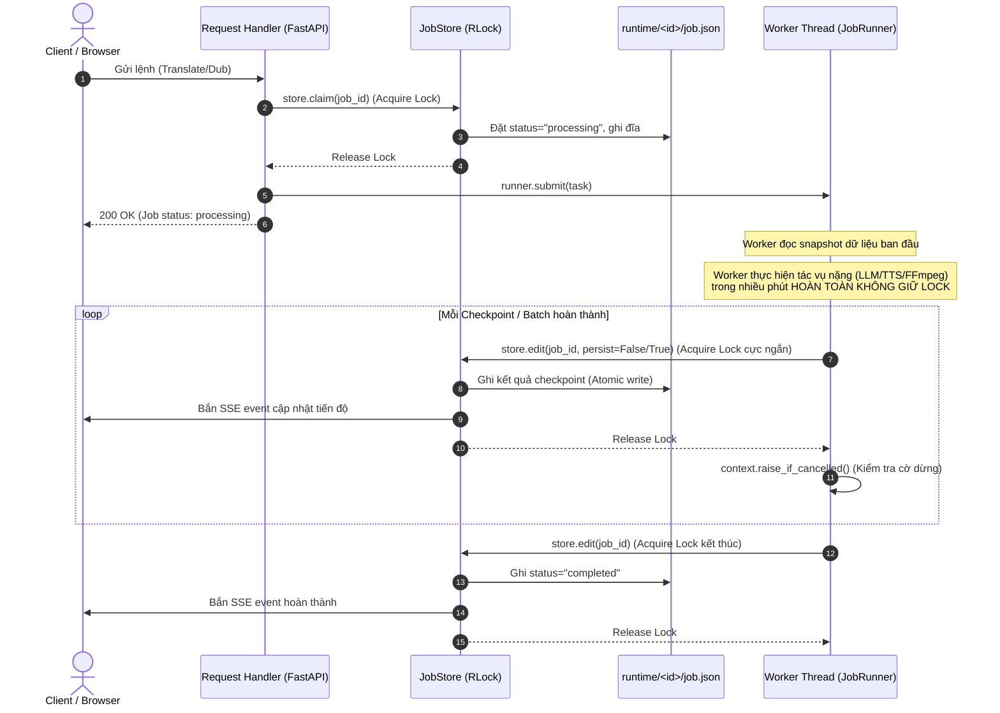
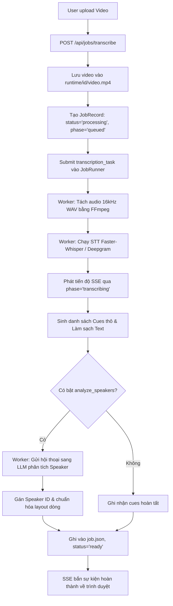
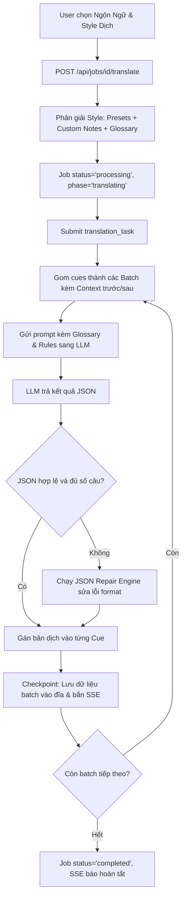
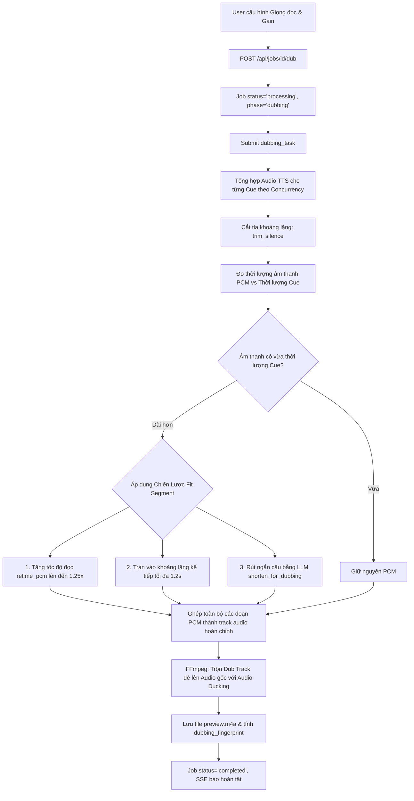

# Cấu Trúc & Kiến Trúc Chi Tiết Backend (AutoCC)

Tài liệu này phân tích toàn diện kiến trúc, cấu trúc thư mục, trách nhiệm của từng module và các cơ chế kỹ thuật cốt lõi trong hệ thống **Backend của AutoCC**.

---

## 1. Tổng Quan Kiến Trúc & Các Nguyên Lý Cốt Lõi

Backend AutoCC được phát triển trên nền tảng **FastAPI (Python 3.10+)**, xây dựng theo mô hình **Layered Modular Architecture** (Kiến trúc phân tầng hướng module), được tối ưu hóa đặc thù cho các tác vụ xử lý đa phương tiện (Video/Audio/FFmpeg) và các AI Pipeline chạy nền kéo dài (Long-running Background Jobs).

```
┌─────────────────────────────────────────────────────────────────────────────────┐
│                           PRESENTATION LAYER (FastAPI)                          │
│   app.py  │  api/jobs.py  │  api/media.py  │  api/styles.py  │  api/system.py   │
└────────────────────────────────────────┬────────────────────────────────────────┘
                                         │
                                         ▼
┌─────────────────────────────────────────────────────────────────────────────────┐
│                    APPLICATION & JOB MANAGEMENT LAYER (jobs/)                   │
│   JobRunner (ThreadPoolExecutor)  │  JobStore (RLock + JSON Persistence)        │
│   JobContext (Progress & Checkpoints)  │  Background Tasks (tasks.py)           │
└───────────────┬────────────────────────┴───────────────────────┬────────────────┘
                │                                                │
                ▼                                                ▼
┌──────────────────────────────────────┐ ┌────────────────────────────────────────┐
│        AI ENGINES LAYER (ai/)        │ │      DOMAIN & ALGORITHMS (domain/)     │
│  - transcription.py (Whisper/DG)     │ │  - subtitles/ (parser, layout, styles) │
│  - translation.py (LLM Batching)     │ │  - dubbing/ (aligner, audio_dsp)       │
│  - diarization.py (Speaker Turns)    │ │  - translation/ (style, glossary)      │
│  - tts.py (EdgeTTS / Synthesis)      │ └────────────────────────────────────────┘
│  - llm.py (OpenAI-compatible / HF)   │                         │
└───────────────┬──────────────────────┘                         │
                │                                                │
                ▼                                                ▼
┌─────────────────────────────────────────────────────────────────────────────────┐
│                 INFRASTRUCTURE & CORE ENGINE (infrastructure/ & core/)          │
│   - infrastructure/media/ffmpeg.py (FFmpeg/FFprobe Subprocess Wrappers)         │
│   - infrastructure/providers/ (Transcription, Translation, TTS Adapters)        │
│   - core/apikeys.py (CredentialPool)   │  core/cancellation.py (Stop Hooks)     │
│   - core/config.py (Settings & Env)    │  core/httpclient.py (Retry & Backoff)  │
│   - core/messages.py (CodedError & i18n Tokens)                                │
└─────────────────────────────────────────────────────────────────────────────────┘
```

### Các nguyên lý thiết kế chính trong Backend:

1. **FastAPI Facade & Separation of Concerns**:
   Route signature được tập trung làm lớp facade ổn định (`api/jobs.py`), trong khi logic nghiệp vụ chia thành các module độc lập (`job_lifecycle.py`, `job_operations.py`, `job_events.py`, `job_shared.py`).
2. **Dedicated Background Worker Pool (`JobRunner`)**:
   Không sử dụng `BackgroundTasks` mặc định của FastAPI (vốn chia sẻ thread pool của server và không giới hạn concurrency). Thay vào đó, backend tự quản lý một `ThreadPoolExecutor` chuyên dụng với số lượng worker kiểm soát được (`MAX_CONCURRENT_JOBS`), đảm bảo một video thứ 3 tải lên sẽ xếp hàng chờ thay vì làm nghẽn CPU/GPU của 2 job đang xử lý.
3. **Thread-Safe File Persistence với Short Critical Sections (`JobStore`)**:
   Dữ liệu mỗi job được lưu độc lập tại `runtime/<job_id>/job.json`. Trạng thái ghi/đọc được đồng bộ bằng `threading.RLock` cho từng job. Quan trọng nhất: **Worker không giữ lock trong quá trình xử lý AI/FFmpeg dài hàng phút**. Worker chỉ lấy snapshot, xử lý ở trạng thái unlocked, sau đó mở lock ngắn hạn (`store.edit()`) trong vài mili-giây để ghi kết quả (atomic write qua temp file) và kích hoạt notification.
4. **Hủy Tác Vụ Hợp Tác An Toàn (Cooperative Cancellation)**:
   Không cưỡng ép dừng thread từ bên ngoài (tránh leak tài nguyên và corrupt dữ liệu). Mọi checkpoint và hàm cập nhật tiến độ (`JobContext.progress()`, `context.raise_if_cancelled()`, `cancellation.py`) đều chủ động kiểm tra cờ `cancel_requested` để dọn dẹp và dừng an toàn.
5. **Credential Pool & Tự Động Phục Hồi Rate Limit (`CredentialPool`)**:
   Hỗ trợ nạp nhiều API key qua định dạng `[key1, key2]` trong file `.env`. Xoay vòng Round-Robin, tự động kích hoạt Cooldown tạm thời khi gặp lỗi 429 / Quota Exceeded và thử lại với key khả dụng tiếp theo.
6. **Script-Aware Subtitle Engine (Xử Lý Đa Ngôn Ngữ & Ký Tự CJK)**:
   Thuật toán ngắt dòng, tính độ dài và tách câu (`split_long_cues`) phân biệt rõ ràng giữa hệ chữ Latin (dựa trên khoảng trắng) và hệ chữ CJK (Trung/Nhật/Hàn - dựa trên mật độ chữ CJK và dấu câu chuyên biệt như `。？！…，、；：`).
7. **Multi-Strategy Dubbing Alignment & Fingerprinting**:
   Thuật toán căn khớp giọng đọc lồng tiếng 3 cấp độ: (1) Tăng tốc độ đọc PCM nhẹ nhàng (`retime_pcm` lên đến `1.25x`), (2) Tràn vào khoảng lặng kế tiếp (`spill` lên đến `1.2s`), (3) Rút ngắn câu bằng LLM (`shorten_with_llm`). Tự động phát hiện dub cũ bị lệch (stale) bằng SHA-256 fingerprint (`dubbing_fingerprint`).
8. **Realtime SSE Streaming & Selective GZip**:
   Truyền phát tiến độ thời gian thực qua Server-Sent Events (`/api/jobs/{id}/events`) với hàng đợi `asyncio.Queue(maxsize=1)` chỉ giữ frame mới nhất. Middleware nén GZip có chọn lọc (`SelectiveGZipMiddleware`) tự động loại trừ các endpoint SSE và streaming media (Range Requests 206) để tránh hiện tượng buffering và lỗi tua video.
9. **Chuẩn Hóa Thông Báo i18n (`Message` & `CodedError`)**:
   Domain và Worker không bao giờ import `HTTPException`. Mọi lỗi hoặc tiến độ đều được đóng gói thành các mã thông báo i18n (`err.*`, `progress.*`, `op.*`) kèm tham số, giúp Frontend tự động hiển thị đa ngôn ngữ chuẩn xác.

---

## 2. Sơ Đồ Cây Thư Mục Toàn Diện

```text
backend/
├── __init__.py                     # Khai báo package backend
├── app.py                          # Khởi tạo FastAPI app, lifespan, CORS, SelectiveGZipMiddleware, exception handlers, static frontend
│
├── core/                           # Hạ tầng kỹ thuật nền tảng dùng chung (Generic Foundation)
│   ├── __init__.py
│   ├── apikeys.py                  # CredentialPool: Quản lý danh sách API keys, xoay vòng Round-Robin, Cooldown, Strikes
│   ├── cancellation.py             # Cơ chế Cooperative Cancellation: OperationCancelled, thread-local stop_check hooks
│   ├── config.py                   # Settings dataclass, load .env, phân giải đường dẫn, parse_api_keys, logger
│   ├── httpclient.py               # Shared HTTP client: retry exponential backoff, rate limit budget, connection pool, proxy
│   └── messages.py                 # Chuẩn hóa thông báo & lỗi i18n: Message, CodedError, detail(), raw()
│
├── domain/                         # Thuật toán & Nghiệp vụ cốt lõi (Pure Python, không gọi API mạng / subprocess)
│   ├── __init__.py
│   ├── subtitles/                  # Nghiệp vụ xử lý phụ đề
│   │   ├── __init__.py
│   │   ├── parser.py               # Parser & Serializer SRT/WebVTT, CJK punctuation splitting, cue cleaning, timecode formatting
│   │   ├── layout.py               # Chuẩn hóa bố cục hội thoại, lọc speaker label legacy, tính điểm ngắt dòng
│   │   └── styles.py               # StyleStore: Quản lý lưu trữ file JSON các custom translation styles của người dùng (runtime/styles.json)
│   ├── dubbing/                    # Nghiệp vụ xử lý đồng bộ giọng đọc
│   │   ├── __init__.py
│   │   ├── aligner.py              # Thuật toán fit_segment (speedup/spill/shorten), cues_fingerprint, dub_is_stale, dub_cues orchestration
│   │   └── audio_dsp.py            # Xử lý PCM thuần Python: trim_silence, pcm_seconds, write_wav, hằng số sample rate/width
│   └── translation/                # Nghiệp vụ phong cách dịch thuật
│       ├── __init__.py
│       └── style.py                # TranslationStyle, StyleBrief, Presets (Hán Việt, Korean, Japanese, GenZ, Formal), parse_style_notes, Glossary
│
├── infrastructure/                 # Giao tiếp hệ điều hành, công cụ ngoài & Service Provider Adapters
│   ├── __init__.py
│   ├── media/                      # Xử lý Media / FFmpeg
│   │   ├── __init__.py
│   │   └── ffmpeg.py               # Wrapper FFmpeg/FFprobe: extract audio, decode/retime PCM, mix dub ducking, soft mux, thumbnail, waveform
│   └── providers/                  # Registry Adapter cho các nhà cung cấp bên ngoài (Protocol + Implementation Lookup)
│       ├── __init__.py             # Re-export provider getters
│       ├── transcription.py        # STT Provider Protocol: FasterWhisperProvider (local), DeepgramProvider (cloud)
│       ├── translation.py          # Translation Provider Protocol: Mock, Transformers (local pipeline), OpenAICompatible
│       └── tts.py                  # TTS Provider Protocol: EdgeTTSProvider, MockTTSProvider, danh sách VOICES
│
├── ai/                             # Tầng AI Engine & Pipelines chuyên sâu
│   ├── __init__.py                 # Interface AI cấp cao: transcribe_video, translate_cues, analyze_dialogue_turns, shorten_for_dubbing
│   ├── diarization.py              # Phân tích người nói (Speaker Turn Analysis & Layout Optimization) bằng LLM
│   ├── llm.py                      # Client OpenAI-compatible chat-completions (Ollama/LM Studio/Hosted API) + Local Transformers pipeline
│   ├── shared.py                   # Custom errors (AIProviderError, AIResponseFormatError), progress callback typing, logger
│   ├── transcription.py            # Pipeline STT (Faster-Whisper local với VAD/int8/GPU-CPU caching, Deepgram Cloud STT)
│   ├── translation.py              # Pipeline dịch thuật (Gom batch, system prompt injection theo style/glossary, retry & repair JSON)
│   └── tts.py                      # Orchestrator TTS: Edge-TTS synthesis, mock synthesis, voice listing & defaults
│
├── api/                            # Tầng HTTP Routers & Endpoints (Presentation)
│   ├── __init__.py                 # Package init
│   ├── jobs.py                     # APIRouter facade chính cho prefix /api/jobs
│   ├── job_lifecycle.py            # Handlers vòng đời Job: list, delete, import-subtitle, start/restart transcribe, get, cancel, update cues, download
│   ├── job_operations.py           # Handlers nghiệp vụ AI: start translation, start dubbing, start speaker analysis
│   ├── job_events.py               # Server-Sent Events (SSE) streaming endpoint (/api/jobs/{id}/events) & format SSE data
│   ├── job_schemas.py              # Pydantic schemas: CueModel, CuesPayload, DubPayload, TranslatePayload
│   ├── job_shared.py               # Shared helpers: claim context manager, new_job_directory, save_upload, engine resolvers, job_summary
│   ├── media.py                    # Router /api/jobs: /{id}/video, /{id}/dub-audio (HTTP 206 Range), /{id}/thumbnail, /{id}/waveform, /{id}/mux
│   ├── styles.py                   # Router /api/styles: CRUD user translation style profiles (list, create, update, delete)
│   └── system.py                   # Router /api: /health, /capabilities (kiểm tra phần cứng, GPU, ffmpeg, providers, models catalogue)
│
└── jobs/                           # Tầng Quản Lý Trạng Thái & Thực Thi Nền
    ├── __init__.py                 # Re-export JobStore, runner, JobNotFound, JobConflict
    ├── model.py                    # Hằng số Status, Phase, Kind; hàm new_job, new_job_id, make_progress, clean_cues, public_job
    ├── runner.py                   # JobRunner (ThreadPoolExecutor worker pool), JobContext, finish(), describe_error()
    ├── store.py                    # JobStore: Thread-safe repository, RLock per-job, atomic JSON persistence, summary caching, SSE pub/sub
    ├── tasks.py                    # Triển khai 4 background workflows: transcription_task, speaker_analysis_task, translation_task, dubbing_task
    └── types.py                    # TypedDict definitions: JobRecord, CueRecord, ProgressRecord
```

---

## 3. Phân Tích Chi Tiết Từng Module & Tệp Tin

### 3.1. `backend/core/` — Hạ Tầng Kỹ Thuật Dùng Chung

| Tệp Tin | Mục Đích | Trách Nhiệm Chi Tiết |
| :--- | :--- | :--- |
| **`config.py`** | Cấu hình & Môi trường | - Tự động đọc `.env` không phụ thuộc thư viện thứ ba (`_load_local_env`).<br>- Định nghĩa đường dẫn gốc: `ROOT_DIR`, `FRONTEND_DIR`, `RUNTIME_DIR`.<br>- Hàm `parse_api_keys()`: Đọc chuỗi đơn hoặc mảng JSON `[key1, key2]`, lọc trùng lặp.<br>- Dataclass `Settings`: Lưu trữ toàn bộ cấu hình hệ thống (Whisper, Deepgram, LLM, TTS, Dubbing, Concurrency, Cache, Logging).<br>- Thiết lập logger `autocc` với console stream handler chuẩn. |
| **`apikeys.py`** | Quản lý Pool API Key | - Lớp `CredentialPool`: Quản lý pool keys cho từng provider.<br>- Xoay vòng Round-Robin giữa các worker.<br>- Cơ chế `strike()` & `Cooldown`: Khi một key bị 429/hạn mức, tạm khóa trong 60 giây và tự động chuyển sang key kế tiếp; tự động phục hồi khi hết thời gian cooldown. |
| **`cancellation.py`** | Quản lý Hủy Tác Vụ | - Cung cấp Exception `OperationCancelled`.<br>- Quản lý hàm kiểm tra dừng (`stop_check`) theo từng thread (thread-local qua `threading.local()`), giúp các hàm xử lý CPU/IO nặng kiểm tra cờ hủy định kỳ qua `check_stop()`. |
| **`messages.py`** | Chuẩn Hóa Thông Báo i18n | - Lớp `Message`: Biểu diễn mã thông báo (`code`) và tham số đi kèm (`params`), xuất ra dict để Frontend tự động tra cứu từ điển ngôn ngữ.<br>- Lớp `CodedError`: Exception mang theo đối tượng `Message`, cho phép raise lỗi có cấu trúc từ tầng domain/worker mà không phụ thuộc vào FastAPI `HTTPException`.<br>- Hàm trợ giúp: `detail()`, `raw()`. |
| **`httpclient.py`** | HTTP Client Dùng Chung | - Xây dựng trên `urllib.request` / `http.client` với connection pooling, SSL context an toàn.<br>- Tự động Retry với Exponential Backoff khi gặp lỗi mạng tạm thời hoặc 5xx/429.<br>- Cơ chế ngân sách retry riêng biệt cho Rate Limit (`http_rate_limit_retries`).<br>- Tích hợp kiểm tra cờ hủy `check_stop()` trong thời gian sleep giữa các lần retry. |

---

### 3.2. `backend/domain/` — Thuật Toán & Nghiệp Vụ Thuần Python

Tầng này chứa các thuật toán cốt lõi, hoàn toàn độc lập với web framework và không gọi trực tiếp API mạng hay subprocess bên ngoài.

```text
backend/domain/
├── subtitles/
│   ├── parser.py       # Phân tích cú pháp SRT/VTT, CJK-aware splitting, clean cues
│   ├── layout.py       # Bố cục hội thoại, phát hiện ngắt dòng, chuẩn hóa text
│   └── styles.py       # StyleStore: Quản lý custom styles của user trên đĩa
├── dubbing/
│   ├── aligner.py      # Thuật toán fit_segment, cues_fingerprint, dub_is_stale, dub_cues
│   └── audio_dsp.py    # Xử lý PCM: trim silence, pcm_seconds, write_wav
└── translation/
    └── style.py        # Quản lý style dịch thuật, preset prompts, custom glossary
```

| Tệp Tin | Mục Đích | Trách Nhiệm Chi Tiết |
| :--- | :--- | :--- |
| **`subtitles/parser.py`** | Xử Lý Phụ Đề & CJK | - Parser & Serializer chuẩn cho SRT và WebVTT (`parse_subtitle`, `format_subtitle`).<br>- **CJK-Aware**: Nhận diện ký tự CJK (Han, Hiragana, Katakana, Hangul). Đo lường độ dài hiển thị thực tế (ký tự CJK chiếm không gian gấp đôi ký tự Latin).<br>- Thuật toán `split_long_cues`: Tách các cue quá dài dựa trên dấu chấm câu CJK (`。？！…，、；：`) hoặc khoảng trắng Latin mà không làm đứt gãy từ.<br>- Hàm `strip_speaker_labels()`: Xóa nhãn speaker legacy như `[S1]`, `[speaker 2]`. |
| **`subtitles/layout.py`** | Bố Cục & Ngắt Dòng | - Hàm `clean_dialogue_layout()`: Chuẩn hóa dòng hội thoại, loại bỏ nhãn cũ, giữ nguyên cấu trúc dòng hợp lệ.<br>- Hàm `dialogue_break_positions()`: Tính toán vị trí offset từ để xác định điểm ngắt dòng tự nhiên của câu.<br>- Hàm `same_dialogue_content()`: So sánh nội dung câu thoại bỏ qua khoảng trắng. |
| **`subtitles/styles.py`** | Quản Lý Custom Styles | - Lớp `StyleStore`: Quản lý danh sách các Style dịch thuật do người dùng tự tạo và lưu trữ vào `runtime/styles.json`.<br>- Thread-safe với `threading.RLock`, ghi an toàn qua temp file atomically.<br>- Cung cấp các thao tác CRUD: `list()`, `get()`, `create()`, `update()`, `delete()`.<br>- Giới hạn an toàn: Tên tối đa 60 ký tự, ghi chú tối đa 2000 ký tự, tối đa 200 styles. |
| **`dubbing/aligner.py`** | Điều Phối Căn Khớp Dubbing | - Thuật toán **`fit_segment`**: Căn khớp âm thanh TTS vào khoảng thời gian của cue theo 3 chiến lược: (1) Tăng tốc độ đọc (`retime_pcm`), (2) Tràn vào khoảng lặng kế tiếp (`spill`), (3) Rút ngắn câu bằng LLM (`shorten_with_llm`).<br>- Hàm `cues_fingerprint()`: Tính hash SHA-256 trên nội dung và timing của toàn bộ cues.<br>- Hàm `dub_is_stale()`: So sánh fingerprint hiện tại với fingerprint lúc dub để cảnh báo khi user sửa phụ đề sau khi đã dub.<br>- Hàm `dub_cues()`: Điều phối luồng tổng hợp audio song song (bounded concurrency), decode PCM, ghép track và tạo báo cáo chi tiết. |
| **`dubbing/audio_dsp.py`** | Xử Lý Tín Hiệu PCM Thuần | - Xử lý mảng bytes PCM (16-bit Mono, 24kHz) hoàn toàn bằng thư viện chuẩn Python (`array`, `wave`).<br>- `trim_silence`: Cắt tỉa khoảng lặng đầu/cuối của file âm thanh.<br>- `pcm_seconds`: Tính thời lượng chính xác của đoạn PCM.<br>- `write_wav`: Đóng gói dữ liệu raw PCM thành file WAV hoàn chỉnh. |
| **`translation/style.py`** | Quản Lý Phong Cách Dịch | - Định nghĩa các Presets có sẵn (`STYLES`): Neutral, Hán Việt (`han_viet`), Phim Hàn (`korean`), Anime Nhật (`japanese`), Giới trẻ (`genz`), Trang trọng (`formal`).<br>- Tự động gợi ý style dựa trên ngôn ngữ nguồn (`LANGUAGE_STYLES`): `zh/yue` -> `han_viet`, `ko` -> `korean`, `ja` -> `japanese`.<br>- Hàm `parse_style_notes()`: Tách ghi chú người dùng thành bảng thuật ngữ cố định (Glossary Terms qua dấu `→`, `->`, `=`, `=>`) và các quy tắc tự do (Prompt Rules).<br>- Hàm `build_style_brief()`: Tổng hợp `StyleBrief` (luật dịch + glossary đã ghim) để đưa vào prompt dịch của LLM. |

---

### 3.3. `backend/infrastructure/` — Hạ Tầng Ngoại Vi & Providers

Tách biệt việc gọi công cụ hệ thống (FFmpeg) và tích hợp các nhà cung cấp dịch vụ (Whisper, Deepgram, LLM, EdgeTTS).

```text
backend/infrastructure/
├── media/
│   └── ffmpeg.py         # Subprocess wrappers cho FFmpeg và FFprobe
└── providers/
    ├── transcription.py  # faster_whisper (local), deepgram (cloud)
    ├── translation.py    # mock, transformers (local), openai_compatible
    └── tts.py            # edge (EdgeTTS), mock
```

| Tệp Tin | Mục Đích | Trách Nhiệm Chi Tiết |
| :--- | :--- | :--- |
| **`media/ffmpeg.py`** | Wrapper FFmpeg An Toàn | - Tìm kiếm binary FFmpeg trên hệ thống (`find_ffmpeg`).<br>- Thực thi subprocess có timeout và bắt lỗi chuẩn hóa (`FFmpegError`, `NoAudioTrack`).<br>- `extract_transcription_audio`: Tách âm thanh từ video sang WAV (16kHz Mono).<br>- `decode_to_pcm` & `retime_pcm`: Chuyển đổi và co giãn thời lượng âm thanh.<br>- `mix_dub_over_original`: Trộn track lồng tiếng đè lên video gốc kèm tính năng giảm âm lượng gốc (**Audio Ducking**).<br>- `mux_soft_subtitles` & `mux_dubbed_video`: Đóng gói phụ đề mềm / audio dub vào container MP4.<br>- `render_thumbnail`: Trích xuất ảnh đại diện video dạng JPEG.<br>- `extract_waveform`: Trích xuất dữ liệu biên độ sóng âm (waveform peaks) phục vụ hiển thị timeline. |
| **`providers/transcription.py`** | Registry Nhà Cung Cấp STT | - `TranscriptionProvider` Protocol.<br>- `FasterWhisperProvider`: Adapter gọi `ai.transcription._transcribe_faster_whisper` (Local).<br>- `DeepgramProvider`: Adapter gọi `ai.transcription.transcribe_video_deepgram` (Cloud).<br>- Import lazy để không nạp model nặng khi chỉ khởi động server. |
| **`providers/translation.py`** | Registry Nhà Cung Cấp Dịch | - `TranslationProvider` Protocol.<br>- `OpenAICompatibleTranslationProvider`: Gửi prompt dịch theo batch đến endpoint OpenAI-compatible.<br>- `TransformersTranslationProvider`: Sử dụng HuggingFace pipeline chạy offline trên máy.<br>- `MockTranslationProvider`: Trả về text giả lập cho unit test. |
| **`providers/tts.py`** | Registry Nhà Cung Cấp TTS | - `TTSProvider` Protocol.<br>- `EdgeTTSProvider`: Adapter gọi Microsoft Edge TTS (miễn phí, chất lượng cao).<br>- `MockTTSProvider`: Tạo file WAV giả lập cho môi trường test.<br>- Danh mục giọng đọc `VOICES` đa ngôn ngữ (Tiếng Việt: Hoài My, Nam Minh; Tiếng Anh, Nhật, Hàn, Trung...). |

---

### 3.4. `backend/ai/` — Tầng AI Engine & Pipelines Chuyên Sâu

Chịu trách nhiệm trực tiếp về tương tác AI, prompt engineering, batching và xử lý lỗi format phản hồi từ mô hình.

```text
backend/ai/
├── __init__.py        # Re-export các hàm cấp cao của module AI
├── transcription.py   # Pipeline STT (Faster-Whisper local, Deepgram cloud)
├── translation.py     # Pipeline dịch thuật (Batching, Style Prompt, JSON Repair, Shortening)
├── diarization.py     # Phân tích lượt nói (Speaker Turn Analysis) bằng LLM
├── llm.py             # Client HTTP OpenAI-compatible + Transformers local
├── shared.py          # Lỗi chung (AIProviderError, AIResponseFormatError), callbacks
└── tts.py             # Orchestrator TTS: EdgeTTS synthesis, mock synthesis
```

* **`transcription.py`**:
  * Chế độ **Local Faster-Whisper**: Hỗ trợ VAD filter, tự động chọn device (CUDA/CPU), cache model theo cấu hình `WHISPER_MODEL_CACHE`, phát hiện ngôn ngữ tự động và báo cáo tiến độ theo tỷ lệ thời lượng audio đã quét.
  * Chế độ **Cloud Deepgram**: Tự động nhận diện người nói sẵn qua diarization của Deepgram API.
* **`translation.py`**:
  * **Batching Cues**: Gom nhóm các câu phụ đề thành các batch hợp lý (kèm 2-3 câu ngữ cảnh trước/sau) để LLM hiểu đúng ngữ cảnh phim mà không vượt giới hạn token.
  * **Style & Glossary Prompt Injection**: Tiêm luật dịch và bảng thuật ngữ ghim vào System Prompt.
  * **JSON Repair Engine**: Phân tích phản hồi JSON từ LLM; nếu LLM trả về markdown bọc ngoài hoặc gộp sai số dòng, tự động sửa lỗi và map chính xác từng câu dịch vào từng ID cue tương ứng.
  * **`shorten_for_dubbing()`**: Prompt chuyên biệt yêu cầu LLM rút gọn câu dịch sao cho ngắn hơn mà vẫn giữ nguyên ý nghĩa để khớp thời lượng nói.
* **`llm.py`**:
  * Client gọi API chat-completions chuẩn OpenAI (tương thích Ollama, LM Studio, vLLM, OpenAI, DeepSeek, Mistral...).
  * Tích hợp `CredentialPool` tự động đổi key khi bị rate limit.
  * Tích hợp cơ chế delay giữa các request (`llm_min_interval_seconds`) để tránh làm sập rate-limit của nhà cung cấp.
  * Tích hợp pipeline dịch local bằng thư viện `transformers` (chạy trên CPU/GPU không cần qua HTTP).
* **`diarization.py`**:
  * Phân tích ngữ cảnh đoạn hội thoại qua LLM để gán nhãn người nói (`speaker 1`, `speaker 2`...) và tối ưu hóa vị trí ngắt dòng câu thoại cho tự nhiên.
* **`tts.py`**:
  * Thực thi tổng hợp giọng nói qua thư viện `edge-tts` theo cơ chế bất đồng bộ `asyncio`.

---

### 3.5. `backend/api/` — Tầng HTTP Routers & Endpoints (Presentation)

Tầng tiếp nhận request từ Frontend, kiểm tra tính hợp lệ dữ liệu và điều phối đến các use-cases tương ứng.

```text
backend/api/
├── jobs.py            # APIRouter facade chính (/api/jobs)
├── job_lifecycle.py   # Use-cases: Upload, Create, List, Get, Delete, Cues Edit, Download
├── job_operations.py  # Use-cases: Translate, Dub, Analyze Speakers
├── job_events.py      # Server-Sent Events (/api/jobs/{id}/events)
├── job_schemas.py     # Pydantic Schemas
├── job_shared.py      # Tiện ích chia sẻ giữa các route
├── media.py           # Stream video (206 Range), Waveform, Thumbnail, Mux preview
├── styles.py          # CRUD Translation Styles (/api/styles)
└── system.py          # /api/health, /api/capabilities
```

#### Bảng Tra Cứu Toàn Bộ API Endpoints

| Nhóm | Method | Đường Dẫn | Chức Năng Chi Tiết |
| :--- | :--- | :--- | :--- |
| **System** | `GET` | `/api/health` | Kiểm tra trạng thái hoạt động của server AutoCC |
| | `GET` | `/api/capabilities` | Trả về danh sách tính năng khả dụng (Whisper local/cuda, Deepgram, LLM catalogue theo host, TTS voices, FFmpeg, số lượng API keys...) |
| **Styles** | `GET` | `/api/styles` | Lấy danh sách custom translation styles đã lưu |
| | `POST` | `/api/styles` | Tạo mới một custom style (Tên, Base preset, Ghi chú/Glossary) |
| | `PATCH` | `/api/styles/{id}` | Cập nhật style (Đổi tên, đổi base, sửa ghi chú) |
| | `DELETE` | `/api/styles/{id}` | Xóa một custom style khỏi hệ thống |
| **Jobs Vòng Đời** | `GET` | `/api/jobs` | Lấy danh sách tóm tắt toàn bộ jobs hiện có (kèm cache) |
| | `POST` | `/api/jobs/transcribe` | Upload video, tạo job mới và bắt đầu tác vụ phiên âm |
| | `POST` | `/api/jobs/import-subtitle` | Upload file phụ đề SRT/VTT để tạo job chỉnh sửa/dịch/dub |
| | `GET` | `/api/jobs/{id}` | Lấy toàn bộ thông tin chi tiết của một job (Public projection) |
| | `DELETE` | `/api/jobs/{id}` | Xóa job và dọn dẹp toàn bộ thư mục dữ liệu trên đĩa |
| | `POST` | `/api/jobs/{id}/transcribe`| Chạy lại phiên âm với tham số model / ngôn ngữ mới |
| | `POST` | `/api/jobs/{id}/cancel` | Gửi tín hiệu yêu cầu hủy tác vụ đang chạy |
| | `PUT` | `/api/jobs/{id}/cues` | Cập nhật danh sách phụ đề đã chỉnh sửa từ người dùng |
| | `POST` | `/api/jobs/{id}/split-long-cues` | Tự động phân tách các câu phụ đề quá dài |
| | `GET` | `/api/jobs/{id}/download` | Xuất và tải về file phụ đề SRT hoặc WebVTT (source/translated) |
| | `GET` | `/api/jobs/{id}/events` | Kết nối Server-Sent Events (SSE) stream cập nhật trạng thái thời gian thực |
| **Jobs Nghiệp Vụ** | `POST` | `/api/jobs/{id}/translate` | Bắt đầu tiến trình dịch thuật phụ đề bằng AI |
| | `POST` | `/api/jobs/{id}/dub` | Bắt đầu tiến trình tổng hợp giọng đọc & ghép track dubbing |
| | `POST` | `/api/jobs/{id}/analyze-speakers` | Bắt đầu tiến trình phân tích người nói bằng LLM |
| **Media & Stream** | `GET` | `/api/jobs/{id}/thumbnail` | Lấy ảnh thumbnail đại diện của video (JPEG) |
| | `GET` | `/api/jobs/{id}/waveform` | Lấy dữ liệu biên độ sóng âm waveform (JSON) |
| | `GET` | `/api/jobs/{id}/video` | Streaming video với hỗ trợ HTTP 206 Partial Content (Range header) |
| | `GET` | `/api/jobs/{id}/dub-audio` | Streaming file audio lồng tiếng hoàn chỉnh (HTTP 206 Range) |
| | `POST` | `/api/jobs/{id}/mux` | Đóng gói tức thời video + phụ đề + audio lồng tiếng để xuất file MP4 |

---

### 3.6. `backend/jobs/` — Tầng Quản Lý Trạng Thái & Thực Thi Nền

Kiểm soát vòng đời, đảm bảo tính toàn vẹn dữ liệu đa luồng và thực thi các background jobs.

```text
backend/jobs/
├── types.py    # TypedDict: JobRecord, CueRecord, ProgressRecord
├── model.py    # Hằng số Status, Phase, hàm new_job, make_progress, clean_cues, public_job
├── store.py    # JobStore: Thread-safe repository, RLock, JSON persistence, SSE queue
├── runner.py   # JobRunner: ThreadPoolExecutor pool, JobContext, cancellation, describe_error
└── tasks.py    # Workflows: transcription_task, speaker_analysis_task, translation_task, dubbing_task
```

#### Cấu Trúc Dữ Liệu `JobRecord` (`types.py` & `model.py`)

Một job trong `runtime/<job_id>/job.json` bao gồm các trường chính:
* `id` & `revision`: ID định danh (UUID v4) và số phiên bản tăng dần theo mỗi lần cập nhật.
* `kind`: `"transcription"` hoặc `"subtitle_import"`.
* `status`: `"processing"`, `"ready"`, `"completed"`, `"error"`, `"cancelled"`.
* `progress`: `{ "phase": "transcribing", "current": 10, "total": 100, "ratio": 0.1, "message": {...} }`.
* `cancel_requested`: Boolean - cờ yêu cầu dừng tác vụ.
* `cues`: Danh sách `CueRecord` (`id`, `start`, `end`, `text`, `translation`, `speaker`).
* `speaker_analysis_*`: Trạng thái (`not_run`, `pending`, `processing`, `completed`, `partial`, `failed`), lỗi và báo cáo phân tích người nói.
* `dubbing_*`: Trạng thái (`pending`, `processing`, `completed`, `partial`, `failed`), provider, voice, fingerprint và báo cáo dubbing.
* `paths` (Internal): `video_path`, `subtitle_path`, `dub_audio_path`. (Được lọc bỏ trong hàm `public_job()` trước khi trả về client).

#### Mô Hình Khóa Đồng Thời (`JobStore` & `JobRunner`)



---

## 4. Các Luồng Thực Thi Cốt Lõi (End-to-End Execution Flows)

### 4.1. Luồng Phiên Âm Video (Transcription Workflow)



---

### 4.2. Luồng Dịch Thuật Phụ Đề (Translation Workflow)



---

### 4.3. Luồng Lồng Tiếng (Dubbing Workflow)



---

## 5. Cơ Chế Xử Lý Lỗi & Bản Địa Hóa (Error Handling & i18n)

### 5.1. Triết Lý Thiết Kế Lỗi Độc Lập Với HTTP

AutoCC áp dụng nguyên tắc **tách biệt hoàn toàn tầng Domain/Workers khỏi tầng Web Framework**:
* Các module trong `domain/`, `jobs/`, `ai/`, `infrastructure/` **không bao giờ import `HTTPException`**.
* Khi có lỗi xảy ra, hệ thống ném các ngoại lệ dẫn xuất từ `CodedError`:
  ```python
  raise CodedError("err.dub.noTrack")
  ```
* Tầng API tiếp nhận lỗi và chuyển đổi thành HTTP Status Code tương ứng:
  - `JobNotFound` ➔ `404 Not Found` với payload `{ "detail": { "code": "err.job.notFound" } }`
  - `JobConflict` ➔ `409 Conflict` với payload `{ "detail": { "code": "err.job.busy" } }`
  - `FFmpegError(missing=True)` ➔ `503 Service Unavailable`
  - `FFmpegError(timed_out=True)` ➔ `504 Gateway Timeout`
  - `ValidationError` ➔ `400 Bad Request`

### 5.2. Danh Mục Các Nhóm Mã Thông Báo Hệ Thống

| Tiền Tố Mã | Ý Nghĩa | Ví Dụ |
| :--- | :--- | :--- |
| `err.job.*` | Lỗi vòng đời và trạng thái job | `err.job.notFound`, `err.job.busy`, `err.job.interrupted`, `err.job.videoGone` |
| `err.subtitle.*` | Lỗi đọc, phân tích và định dạng phụ đề | `err.subtitle.unsupported`, `err.subtitle.unreadable`, `err.subtitle.noCues` |
| `err.translation.*`| Lỗi cấu hình và tiến trình dịch thuật | `err.translation.targetMissing`, `err.translation.styleNotesTooLong`, `err.translation.badStyle` |
| `err.dub.*` | Lỗi tổng hợp giọng nói và lồng tiếng | `err.dub.noTrack`, `err.dub.badGain`, `err.dub.partial`, `err.dub.stopped` |
| `err.ffmpeg.*` | Lỗi công cụ FFmpeg/FFprobe | `err.ffmpeg.missing`, `err.ffmpeg.timeout`, `err.ffmpeg.failed` |
| `progress.*` | Mã tiến độ hiển thị thời gian thực | `progress.queued`, `progress.transcribing`, `progress.translated`, `progress.dubMixing` |
| `style.*` | Tên các preset phong cách dịch thuật | `style.auto`, `style.neutral`, `style.hanViet`, `style.korean`, `style.japanese`, `style.genz`, `style.formal` |

---

## 6. Tổng Kết Điểm Nổi Bật Về Hiệu Năng & Độ Ổn Định

1. **Không Bao Giờ Nghẽn Luồng (Zero UI Blocking)**: Nhờ cơ chế tách rời hoàn toàn giữa luồng đọc snapshot và luồng xử lý nền, người dùng có thể thoải mái xem video, sửa phụ đề, chuyển tab trong lúc server đang phiên âm hoặc dịch hàng chục phút.
2. **Khả Năng Chống Mất Dữ Liệu Tuyệt Đối (Atomic Persistence & Checkpointing)**: Mọi thao tác ghi dữ liệu đều đi qua file tạm `.tmp` trước khi rename nguyên tử, đồng thời các batch dịch thuật đều được checkpoint liên tục. Nếu mất điện hoặc sập app giữa chừng, toàn bộ các câu đã dịch trước đó vẫn được bảo toàn nguyên vẹn.
3. **Tiết Kiệm Băng Thông & Tài Nguyên Đĩa (Optimized Streaming)**:
   - SSE đẩy tiến độ chỉ ghi trên RAM (không ghi đĩa).
   - Video và Dubbed Audio stream qua HTTP Range 206 Partial Content, tua mượt mà không cần download toàn bộ file dung lượng lớn.
   - Endpoint `/mux` render tức thời theo luồng tải xuống mà không cần lưu trữ file xuất trùng lặp trên server.
